# Rapport d'Audit de Sécurité - Application Web Vulnérable

**Date de l'audit :** $(date)  
**Application :** Blog Web Application  
**Version audité :** 1.0.0  
**Auditeur :** Auto (Assistant IA)

---

## Résumé Exécutif

Cet audit de sécurité a identifié **6 vulnérabilités critiques** et **plusieurs faiblesses de sécurité** dans l'application web. Toutes les vulnérabilités ont été corrigées et des mesures de sécurité supplémentaires ont été implémentées.

### Vulnérabilités Identifiées

| Priorité | Vulnérabilité | Statut |
|----------|---------------|--------|
| 🔴 Critique | Injection SQL | ✅ Corrigée |
| 🔴 Critique | Stockage de mots de passe en clair | ✅ Corrigée |
| 🔴 Critique | Absence d'authentification sur routes critiques | ✅ Corrigée |
| 🟠 Élevée | Exposition de données sensibles | ✅ Corrigée |
| 🟠 Élevée | Absence de validation des entrées | ✅ Corrigée |
| 🟡 Moyenne | Contrôle d'accès insuffisant | ✅ Corrigée |

---

## 1. Injection SQL (SQL Injection)

### 1.1 Vulnérabilité dans la recherche d'articles

**Fichier :** `backend/routes/articles.js`  
**Ligne :** 24  
**Sévérité :** 🔴 Critique

#### Description
La route `/api/articles/search` construisait des requêtes SQL en concaténant directement les valeurs utilisateur dans la chaîne SQL, permettant une injection SQL.

#### Code vulnérable
```javascript
const sql = `SELECT * FROM articles WHERE title LIKE '%${title}%'`;
const [results] = await req.db.query(sql);
```

#### Exploitation possible
Un attaquant pourrait exécuter des commandes SQL arbitraires :
```json
{
  "title": "' UNION SELECT id, username, email, password, created_at FROM users -- "
}
```

#### Captures d'écran

**Avant correction** - Injection SQL réussie :
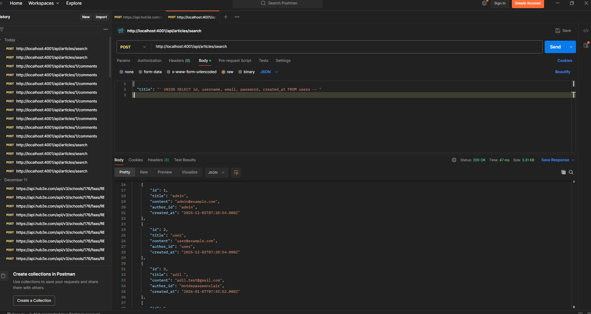

**Après correction** - Injection SQL bloquée :
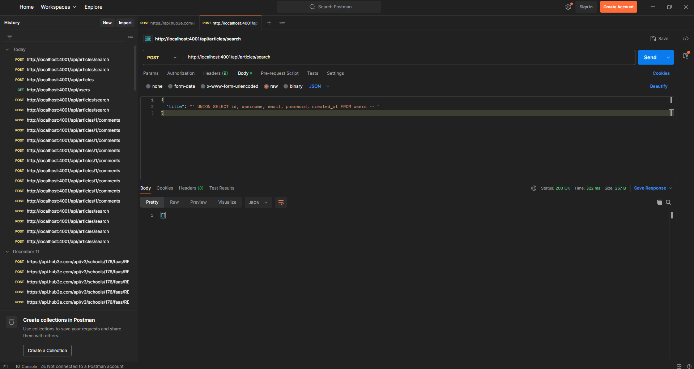

#### Correction appliquée
- Utilisation de requêtes préparées avec `execute()` au lieu de `query()`
- Validation du type de données d'entrée
- Utilisation de paramètres liés pour les valeurs LIKE

```javascript
const sql = 'SELECT * FROM articles WHERE title LIKE ?';
const searchPattern = `%${title}%`;
const [results] = await req.db.execute(sql, [searchPattern]);
```

---

### 1.2 Vulnérabilité dans l'ajout de commentaires

**Fichier :** `backend/routes/comments.js`  
**Ligne :** 41  
**Sévérité :** 🔴 Critique

#### Description
La route POST `/api/articles/:id/comments` construisait des requêtes SQL en concaténant directement les valeurs utilisateur, permettant une injection SQL critique.

#### Code vulnérable
```javascript
const sql = `INSERT INTO comments (user_id, article_id, content) VALUES (${user_id}, ${id}, '${content}')`;
const [results] = await req.db.query(sql);
```

#### Exploitation possible
Un attaquant pourrait :
- Exécuter des commandes SQL arbitraires
- Extraire des données sensibles
- Modifier ou supprimer des données

#### Captures d'écran

**Avant correction** - Injection SQL dans les commentaires :
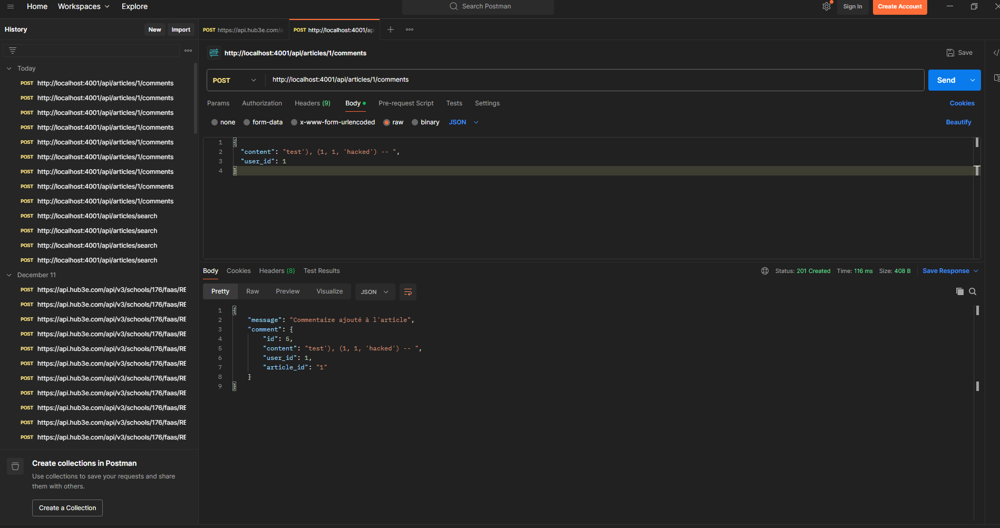
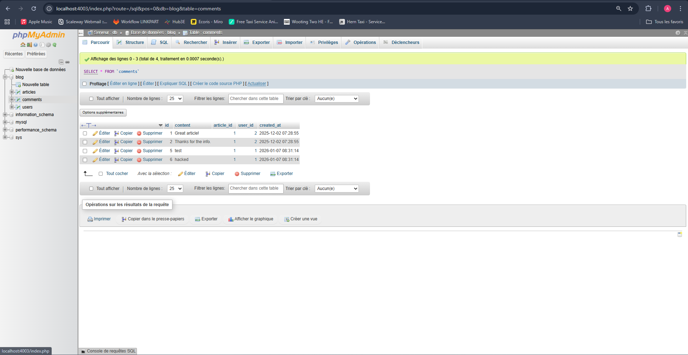


**Après correction** - Requête sécurisée :
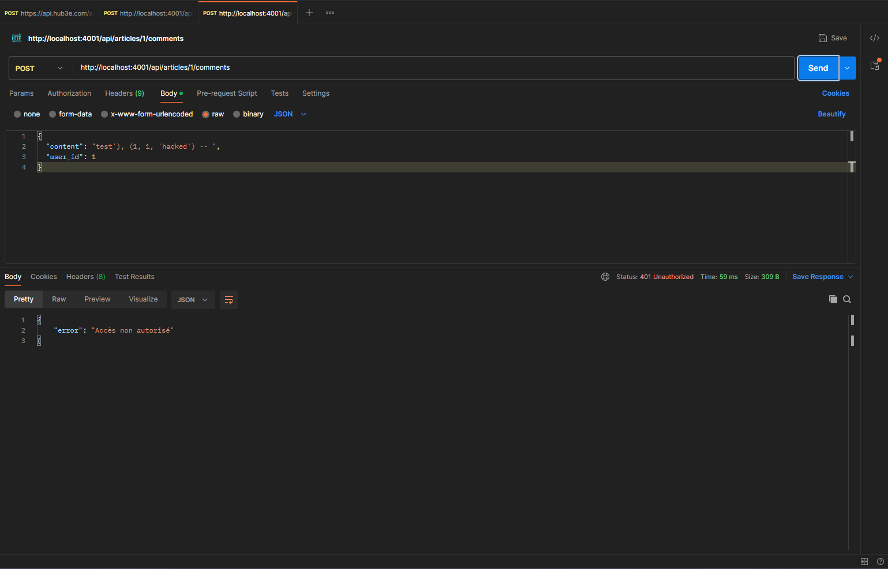

#### Correction appliquée
- Utilisation de requêtes préparées
- Récupération automatique de `user_id` depuis le token JWT
- Validation du contenu avant insertion

```javascript
const user_id = req.user.id;
const sql = 'INSERT INTO comments (content, user_id, article_id) VALUES (?, ?, ?)';
const [results] = await req.db.execute(sql, [content, user_id, id]);
```

---

## 2. Stockage de Mots de Passe en Clair

**Fichier :** `backend/routes/auth.js`  
**Lignes :** 15, 33  
**Sévérité :** 🔴 Critique

### Description
Les mots de passe étaient stockés et comparés en clair dans la base de données, exposant les utilisateurs à des risques majeurs en cas de compromission de la base de données.

### Code vulnérable
```javascript
// Inscription
const [results] = await req.db.execute(insertSql, [username, email, password]);

// Connexion
if (user.password !== password) {
  return res.status(401).json({ error: 'Mot de passe incorrect' });
}
```

#### Captures d'écran

**Avant correction** - Mots de passe en clair dans la base de données (phpMyAdmin) :
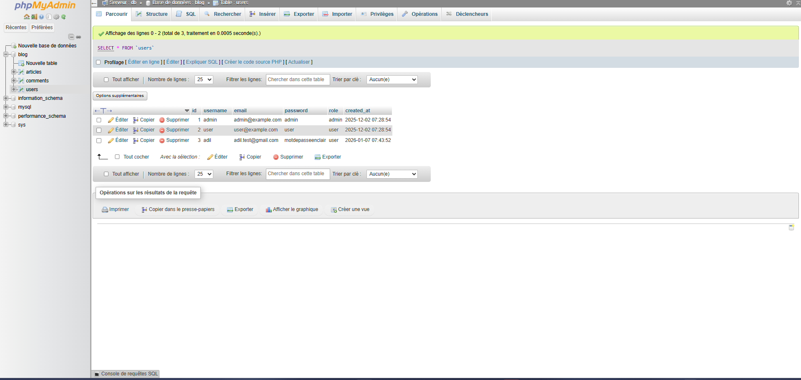

**Après correction** - Mots de passe hachés avec bcrypt :
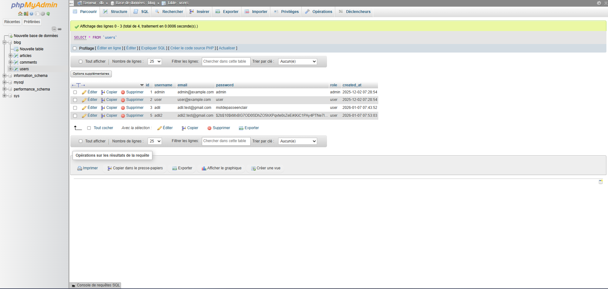

### Risques
- En cas de fuite de base de données, tous les mots de passe sont compromis
- Pas de protection contre les attaques par rainbow tables
- Violation des bonnes pratiques de sécurité

### Correction appliquée
- Implémentation du hachage bcrypt avec 10 rounds de salage
- Comparaison sécurisée des mots de passe lors de la connexion
- Exclusion des mots de passe des réponses API

```javascript
// Inscription
const saltRounds = 10;
const hashedPassword = await bcrypt.hash(password, saltRounds);
const [results] = await req.db.execute(insertSql, [username, email, hashedPassword]);

// Connexion
const passwordMatch = await bcrypt.compare(password, user.password);
if (!passwordMatch) {
  return res.status(401).json({ error: 'Email ou mot de passe incorrect' });
}
```

### Note importante
⚠️ **Les utilisateurs existants devront réinitialiser leurs mots de passe** car les mots de passe en clair ne peuvent pas être convertis en hash rétroactivement.

---

## 3. Absence d'Authentification et d'Autorisation

**Sévérité :** 🔴 Critique

### 3.1 Routes utilisateurs non protégées

**Fichier :** `backend/routes/users.js`

#### Vulnérabilités identifiées
- `GET /api/users` : Liste tous les utilisateurs sans authentification
- `GET /api/users/:id` : Accès à n'importe quel profil utilisateur
- `DELETE /api/users/:id` : Suppression d'utilisateurs sans autorisation
- `PUT /api/users/:id` : Modification d'utilisateurs sans autorisation

#### Captures d'écran

**Avant correction** - Accès sans authentification (requête réussie) :
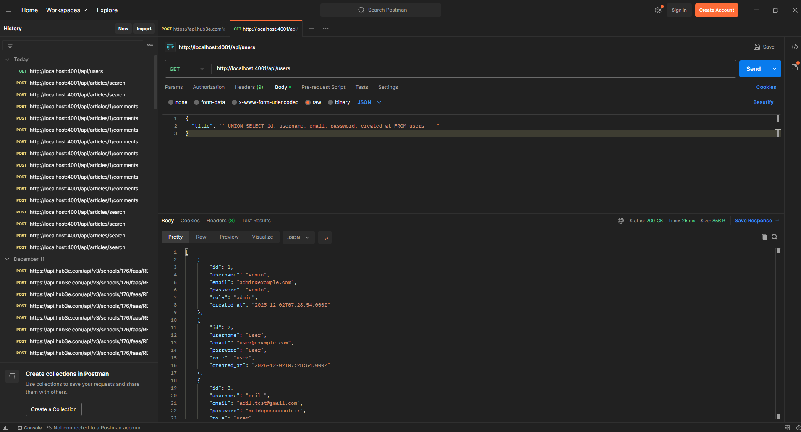

**Après correction** - Accès refusé sans token (erreur 401) :
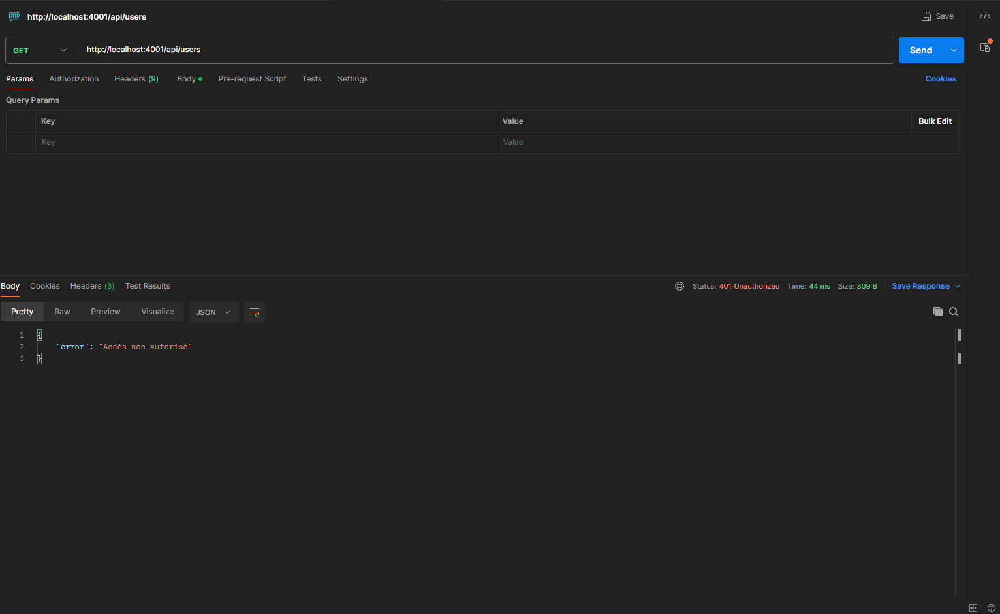

#### Corrections appliquées
- `GET /api/users` : Requiert authentification + rôle admin
- `GET /api/users/:id` : Requiert authentification + vérification que l'utilisateur accède à son propre profil ou est admin
- `DELETE /api/users/:id` : Requiert authentification + rôle admin + protection contre auto-suppression
- `PUT /api/users/:id` : Requiert authentification + vérification des permissions + validation des rôles

### 3.2 Routes articles non protégées

**Fichier :** `backend/routes/articles.js`

#### Vulnérabilités identifiées
- `POST /api/articles` : Création d'articles sans authentification
- `PUT /api/articles/:id` : Modification d'articles sans vérification de propriété

#### Captures d'écran

**Avant correction** - Création d'article sans authentification :
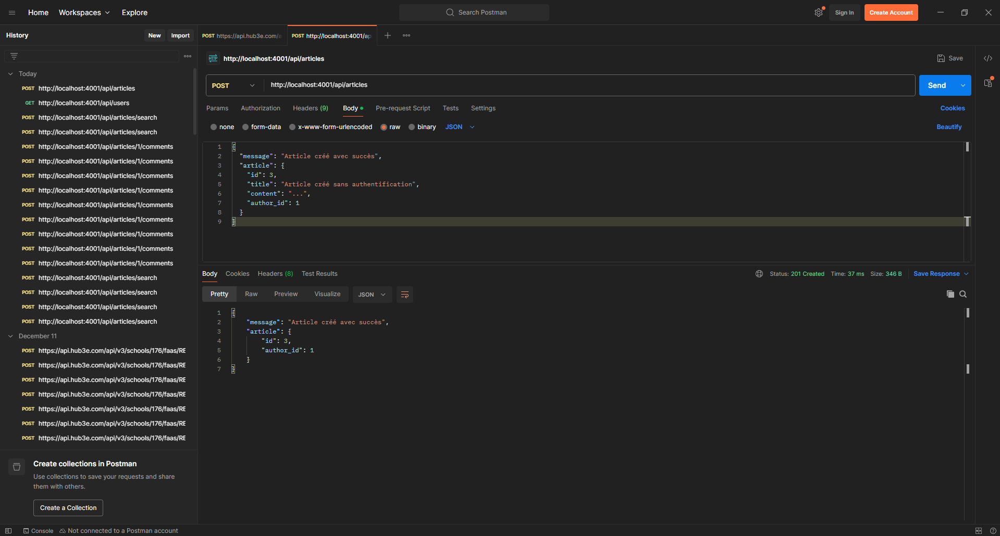

**Après correction** - Création d'article refusée sans token :
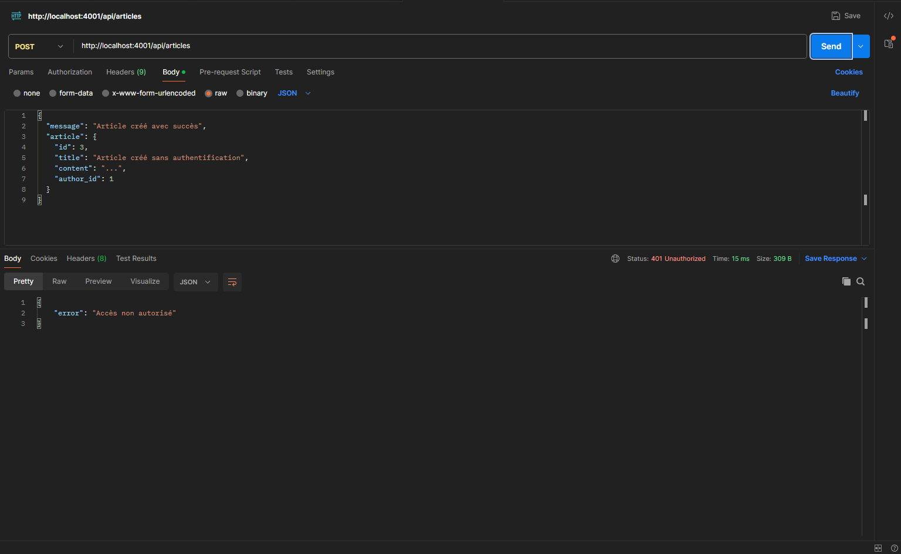

#### Corrections appliquées
- `POST /api/articles` : Requiert authentification, `author_id` récupéré automatiquement depuis le token
- `PUT /api/articles/:id` : Requiert authentification + vérification que l'utilisateur est l'auteur ou un admin

### 3.3 Routes commentaires non protégées

**Fichier :** `backend/routes/comments.js`

#### Vulnérabilités identifiées
- `POST /api/articles/:id/comments` : Ajout de commentaires sans authentification
- `DELETE /api/comments/:id` : Suppression de commentaires sans vérification

#### Corrections appliquées
- `POST /api/articles/:id/comments` : Requiert authentification, `user_id` récupéré automatiquement
- `DELETE /api/comments/:id` : Requiert authentification + vérification que l'utilisateur est l'auteur ou un admin

---

## 4. Exposition de Données Sensibles

**Fichier :** `backend/routes/users.js`  
**Sévérité :** 🟠 Élevée

### Description
Les routes utilisateurs exposaient les mots de passe en clair dans les réponses JSON.

### Code vulnérable
```javascript
const sql = 'SELECT * FROM users';
const [results] = await req.db.execute(sql);
res.json(results); // Contient les mots de passe !
```

### Correction appliquée
- Exclusion explicite des mots de passe dans toutes les requêtes SELECT
- Utilisation de projections SQL pour ne récupérer que les champs nécessaires

```javascript
const sql = 'SELECT id, username, email, role, created_at FROM users';
```

---

## 5. Absence de Validation des Entrées

**Sévérité :** 🟠 Élevée

### Description
Aucune validation n'était effectuée sur les données d'entrée utilisateur, permettant :
- Des valeurs nulles ou vides
- Des types de données incorrects
- Des chaînes vides ou malformées

### Corrections appliquées

#### Validation dans `auth.js`
- Vérification de la présence de tous les champs requis
- Validation de la longueur minimale des mots de passe (6 caractères)
- Validation de la longueur minimale des noms d'utilisateur (3 caractères)
- Validation du format email (présence de @)

#### Validation dans `articles.js`
- Vérification de la présence du titre et du contenu
- Validation du type de données pour la recherche

#### Validation dans `comments.js`
- Vérification de la présence et du type du contenu
- Rejet des chaînes vides

#### Validation dans `users.js`
- Validation conditionnelle des champs modifiés
- Vérification des permissions pour la modification des rôles

---

## 6. Contrôle d'Accès Insuffisant

**Sévérité :** 🟡 Moyenne

### Problèmes identifiés
- Les utilisateurs pouvaient modifier n'importe quel article
- Les utilisateurs pouvaient supprimer n'importe quel commentaire
- Pas de vérification de propriété avant modification/suppression

### Corrections appliquées
- Vérification de la propriété des ressources avant modification
- Autorisation des admins pour toutes les opérations
- Protection contre l'auto-suppression pour les admins
- Contrôle strict des permissions de modification de rôles

---

## Améliorations Supplémentaires Implémentées

### 1. Gestion des erreurs améliorée
- Messages d'erreur cohérents et non révélateurs
- Gestion appropriée des codes de statut HTTP
- Retour de `404` pour les ressources introuvables

### 2. Sécurité des mots de passe
- Hachage bcrypt avec 10 rounds
- Exclusion systématique des mots de passe des réponses
- Messages d'erreur génériques pour éviter l'énumération d'utilisateurs

### 3. Authentification renforcée
- Utilisation systématique des tokens JWT
- Vérification des permissions au niveau des routes
- Récupération automatique de l'ID utilisateur depuis le token

---

## Recommandations Supplémentaires

### Court terme
1. ✅ **Implémenter bcrypt** - FAIT
2. ✅ **Corriger les injections SQL** - FAIT
3. ✅ **Ajouter l'authentification** - FAIT
4. ✅ **Valider les entrées** - FAIT

### Moyen terme
1. **Rate limiting** : Implémenter un rate limiting pour prévenir les attaques par force brute
2. **HTTPS obligatoire** : Forcer l'utilisation de HTTPS en production
3. **Validation côté serveur renforcée** : Utiliser une bibliothèque comme `joi` ou `express-validator`
4. **Logging de sécurité** : Implémenter un système de logs pour les tentatives d'accès non autorisées
5. **CSP (Content Security Policy)** : Ajouter des headers de sécurité HTTP

### Long terme
1. **Authentification multi-facteurs (MFA)** : Pour les comptes administrateurs
2. **Audit de sécurité automatisé** : Intégrer des outils comme OWASP ZAP ou Snyk
3. **Tests de sécurité automatisés** : Intégrer des tests de sécurité dans le CI/CD
4. **Chiffrement des données sensibles** : Pour les données stockées en base
5. **Gestion des sessions** : Implémenter une gestion de session plus robuste avec refresh tokens


---

## Conclusion

Toutes les vulnérabilités critiques identifiées ont été corrigées. L'application est maintenant significativement plus sécurisée avec :

- ✅ Protection contre les injections SQL
- ✅ Hachage sécurisé des mots de passe
- ✅ Authentification et autorisation appropriées
- ✅ Validation des entrées utilisateur
- ✅ Protection des données sensibles

Cependant, il est recommandé de continuer à améliorer la sécurité en implémentant les recommandations supplémentaires mentionnées ci-dessus, notamment le rate limiting et le HTTPS obligatoire en production.

---

## Fichiers Modifiés

- `backend/package.json` - Ajout de bcrypt
- `backend/routes/articles.js` - Correction injection SQL, ajout authentification
- `backend/routes/comments.js` - Correction injection SQL, ajout authentification
- `backend/routes/auth.js` - Implémentation hachage bcrypt, validation
- `backend/routes/users.js` - Ajout authentification/autorisation, masquage mots de passe

---

**Fin du rapport**

